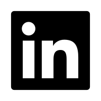

 

     <h1>Jizhen Cai</h1>
     

         
             
             (+33) 06 65 35 41 52
         
         ·
         
             
             jizhencai94@gmail.com
         
         ·
         
             
             <a href="https://github.com/Gogogoforit">Github</a>
         
         ·
         
             
             <a href="https://www.linkedin.com/in/jizhen-cai-7527a9162/">Linkedin</a>
         
         ·
         
             
             <a href="https://blog.csdn.net/garrulousabyss">My Blog</a>
         
     

 

##  À propos de moi

- Salutations ! Je suis Jizhen Cai, un doctorant dévoué en informatique, prêt à défendre ma thèse en mars 2024. Mon parcours académique reflète une passion pour le big data, l'apprentissage automatique, le deep learning, et un vif intérêt pour le traitement des données et le développement logiciel.

- Je me spécialise dans MATLAB et Python, et mes contributions à la recherche incluent l'extension des méthodes de démélange aux images multispectrales et l'introduction d'un modèle CNN triple-stream basé sur l'attention pour la classification d'images hyperspectrales. Ma maîtrise de l'anglais et du français apporte une polyvalence technique et une pensée novatrice à chaque projet.

##  Éducation

- Doctorat en informatique

  - *Université de Bourgogne, France*
  
  - *2019.10 - Présent (Défense prévue : T1 2024)*
  
- Master en simulation et visualisation

  - *Université norvégienne des sciences et technologies, Norvège*
  
  - *2017.9 - 2019.7*
  
- Licence en génie informatique

  - *Université de Chongqing, Chine*
  
  - *2012.9 - 2016.7*

##  Publications

- **Extension des méthodes de démélange aux images multispectrales**

  *Mots clés : Démélange, Télédétection, Images multispectrales, Images hyperspectrales*

  Dans cet article, nous avons créé deux ensembles de données multispectrales simulées à partir de deux ensembles de données hyperspectrales dont les vérités terrain sont fournies. Ensuite, nous appliquons les méthodes de démélange (VCA, NMF, N-FINDR) à ces deux ensembles de données. Les résultats démontrent les possibilités d'étendre ces méthodes de démélange au domaine de l'imagerie multispectrale.

- **Comparaison des méthodes de démélange linéaire sur l'ensemble de données de peintures**

  *Mots clés : Démélange hyperspectral, Extraction d'endmembers*

  Le démélange hyperspectral consiste à extraire des endmembers et à estimer l'abondance de chaque endmember dans chaque pixel des images. Dans cet article, nous présentons trois méthodes de pointe dans l'extraction d'endmembers. Ces méthodes sont initialement utilisées dans le domaine de la télédétection. Elles sont appliquées à un nouveau domaine : les peintures. Nous comparons et analysons leurs performances et résultats.

- **ATSFCNN : un nouveau modèle CNN fusionné à triple flux basé sur l'attention pour la classification d'images hyperspectrales**

  *Mots clés : Apprentissage profond, CNN, Mécanisme d'attention, Classification hyperspectrale*

  Dans cet article, nous proposons un nouveau modèle CNN appelé ATSFCNN (Attention-based Triple-Stream Fused Convolutional Neural Network) qui fusionne les caractéristiques des CNN 1D, 2D et 3D pour prendre en compte toutes les informations pertinentes du jeu de données hyperspectral. Nos contributions sont doubles : d'abord, nous proposons une stratégie pour extraire et homogénéiser les caractéristiques des CNN 1D, 2D et 3D. Ensuite, nous proposons une manière de fusionner efficacement ces caractéristiques.

##  Compétences

- ★★★ Matlab 
- ★★★ Python
- ★★☆ C, C++
- ★★☆ Linux
- ★★☆ Git
- ★★★ MySQL
- ★★☆ JavaScript, CSS
- ★☆☆ Java

##  Langues

- **Anglais : Courant (Utilisé comme langue principale lors de mes études de master et de doctorat)**

  *GRE -- 329/340 (En 2014)*

  *TOFEL -- 103/120 (En 2015)*
  
- **Français : Compétence (Appris pendant mon temps libre pour une meilleure adaptation à l'environnement local)**

  *DELF B2 (En 2022)*

- **Chinois : Langue maternelle**

