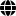

 

     <h1>Jizhen Cai</h1>
     

         
             
             (+33) 06 65 35 41 52
         
         ·
         
             
             jizhencai94@gmail.com
         
         ·
         
             
             <a href="https://github.com/Gogogoforit">Gogogoforit</a>
         
         ·
         
             
             <a href="https://blog.csdn.net/garrulousabyss">My Blog</a>
         
     

 

 ##  About me 

 - Greetings! I'm Jizhen Cai, a passionate and dedicated Ph.D. candidate in Computer Science, set to defend my thesis in early 2024. My academic journey has been marked by a profound interest in machine learning and deep learning, as evidenced by my Master's thesis and ongoing doctoral research.

##  Education

- Doctor of Philosophy，University of Burgundy，France, Computer Science，2019.10~Now
- Master of Science，Norwegian University of Science and Technology，Norway, Simulation and visualisation，2017.9~2019.7
- Bachelor of Engineering, Chongqing University, China, Computer Engineering, 2012.9~2016.7

##  Publication

- **Extending the Unmixing methods to Multispectral Images**

  *Key words: Unmixing, Remote Sensing, Multispectral Images, Hyperspectral Images*

  In this paper, we have created two simulated multispectral datasets from two hyperspectral datasets whose ground truths are given. Then we apply the unmixing methods (VCA, NMF, N-FINDR) to these two datasets. The results demonstrate the possibilities in extending these unmixing methods to the field of multispectral imaging.

- **ATSFCNN: A Novel Attention-based Triple-Stream Fused CNN Model for Hyperspectral Image Classification**

  *Key words: Deep Learning, CNN, Attention Mechanism, Hyperspectral Classification*

  In this paper, we propose a novel CNN model named ATSFCNN (Attention-based Triple-Stream Fused Convolutional Neural Network) that fuses the features of 1D-CNN, 2D-CNN, and 3D-CNN to consider all the relevant information of the hyperspectral dataset. Our contributions are twofold: First, we propose a strategy to extract and homogenize features from 1D, 2D, and 3D CNN. Secondly, we propose a way to efficiently fuse these features.

##  Skills

- ★★★ Matlab 
- ★★★ Python
- ★★☆ C、C++
- ★★☆ Linux
- ★★☆ Git
- ★★★ MySQL
- ★★☆ JavaScript、CSS
- ★☆☆ Java

##  Language

- **English: Proficient (Used as the primary language during my Master's and Ph.D. studies)**

  *GRE -- 329/340 (In 2014)*

  *TOFEL -- 103/120 (In 2015)*
  
- **French: Proficiency (Learned in my free time for better adaptation to the local environment)**
  I think learning the local language is necessary to adapt to the environment, so I learn French in my free time

  *DELF B2 (In 2022)*

- **Chinese: Mother Tongue**

